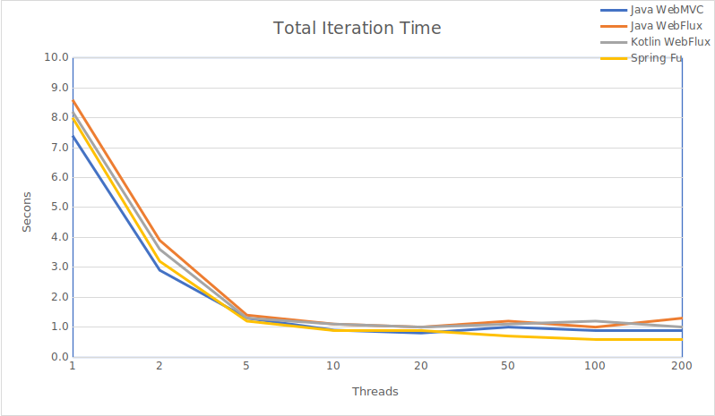
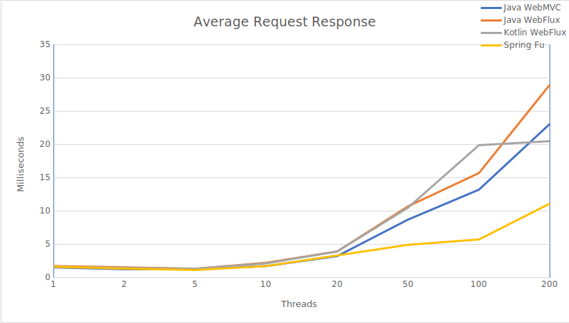

# Reactive Spring 5

## Introduction

This repository is used as part of a presentation on Reactive Spring 5.
The presentation is aimed as gentle introduction to Reactive Spring 5 while illustrating some real-world benefits.

## Requirements

* Java 8
* MongoDB 3.x
* curl
* http

## Mongo Setup


```
mongo
>
use admin
db.createUser(
    {
        user: "admin",
        pwd: "password",
        roles: [{role: "userAdminAnyDatabase", db: "admin"}]
    }
)

use locs
db.createUser(
    {
        user: "user",
        pwd: "password",
        roles: [{role: "readWrite", db: "locs"}]
    }
)
quit()
```

## Running

### Start MongoDB

Start mongodb with `mongod --dbpath <folder>` with folder on a slow drive. 
This will allow for a pronounced difference between non-reactive and reactive tests.

### Populate Database
Populate the database using: 
```bash
./gradlew -Dtest.single=PopulateDatabaseManual :nonreactive-web:test
```

OR when using Spring Fu version
 
```bash
http POST http://localhost:8080/load?count=1000
```

### Run non-reactive version
```bash
./gradlew :nonreactive-web:bootRun
```

### Run reactive version
```bash
./gradlew :reactive-web:bootRun
```

### Run Kotlin Reactive version
```bash
./gradelw :reactive-kotlin:bootRun
```

### Run Spring Fu version
```bash
./gradlew :reactive-fu:bootRun
```

### Scripts

The `scripts` folder contains scripts that use `curl` to perform measurements of the rest calls.

OR

```bash
http http://localhost:8080/last30days
http http://localhost:8080/extlast30days
```

### Generate Load

```bash
java -jar load-generator/build/libs/load-generator-1.0-SNAPSHOT.jar <Label> <Iterations>
```


## Performance Comparison

The load generator is invoked with a number of iterations and will then divide the work over a number of threads stepping up through 1, 2, 5, 10, 20, 50, 100, 200.
 
The performance testing isn't exhaustive since is was done in a single machine.

### Total time to perform iterations on Windows

| Type         | Measure |        1 |        2 |        5 |       10 |       20 |       50 |      100 |      200 |
|--------------|---------|---------:|---------:|---------:|---------:|---------:|---------:|---------:|---------:|
|      WebMVC | Totals  |     32.6 |     17.1 |      9.1 |      7.9 |      7.9 |      8.0 |      9.6 |      8.7 |
|      WebFlux | Totals  |     45.3 |     26.8 |     13.8 |     13.6 |     11.0 |     14.1 |     11.7 |     13.3 |
|    WebFluxKt | Totals  |     42.2 |     23.3 |     13.5 |     10.4 |     10.1 |     10.8 |     11.2 |     10.4 |
|     SpringFu | Totals  |     16.2 |      8.2 |      4.6 |      3.8 |      3.3 |      4.6 |      4.0 |      3.8 |

### Average response time per request on Windows

| Type         | Measure |        1 |        2 |        5 |       10 |       20 |       50 |      100 |      200 |
|--------------|---------|---------:|---------:|---------:|---------:|---------:|---------:|---------:|---------:|
|      WebMVC | Average |     32.5 |     34.1 |     45.3 |     75.8 |    152.0 |    342.5 |    617.2 |   1395.3 |
|      WebFlux | Average |     45.3 |     53.6 |     68.9 |    133.4 |    205.6 |    607.9 |    941.2 |   1570.7 |
|    WebFluxKt | Average |     42.2 |     46.6 |     67.0 |    102.3 |    194.2 |    461.2 |    723.8 |    739.2 |
|     SpringFu | Average |     16.2 |     16.3 |     22.8 |     36.3 |     63.0 |    190.9 |    187.1 |    517.2 |


### Total time to perform iterations on Ubuntu



| Type         | Measure |        1 |        2 |        5 |       10 |       20 |       50 |      100 |      200 |
|--------------|---------|---------:|---------:|---------:|---------:|---------:|---------:|---------:|---------:|
|       WebMVC | Totals  |      7.4 |      2.9 |      1.3 |      0.9 |      0.8 |      1.0 |      0.9 |      0.9 |
|      WebFlux | Totals  |      8.6 |      3.9 |      1.4 |      1.1 |      1.0 |      1.2 |      1.0 |      1.3 |
|    WebFluxKt | Totals  |      8.2 |      3.6 |      1.3 |      1.1 |      1.0 |      1.1 |      1.2 |      1.0 |
|     SpringFu | Totals  |      8.0 |      3.2 |      1.2 |      0.9 |      0.9 |      0.7 |      0.6 |      0.6 |

### Average response time per request on Windows



| Type         | Measure |        1 |        2 |        5 |       10 |       20 |       50 |      100 |      200 |
|--------------|---------|---------:|---------:|---------:|---------:|---------:|---------:|---------:|---------:|
|       WebMVC | Average |      1.5 |      1.2 |      1.2 |      1.7 |      3.2 |      8.7 |     13.2 |     23.1 |
|      WebFlux | Average |      1.7 |      1.5 |      1.3 |      2.2 |      3.9 |     10.7 |     15.7 |     29.0 |
|    WebFluxKt | Average |      1.6 |      1.4 |      1.3 |      2.1 |      3.9 |     10.5 |     19.9 |     20.5 |
|     SpringFu | Average |      1.6 |      1.3 |      1.1 |      1.7 |      3.3 |      4.9 |      5.7 |     11.1 |
